# Biểu đồ Use Case - Coconut Music System

```mermaid
graph TB
    subgraph "Hệ thống Coconut Music"
        subgraph "Chức năng User"
            UC1[Đăng ký]
            UC2[Đăng nhập]
            UC3[Đăng xuất]
            UC4[Nghe nhạc]
            UC5[Tìm kiếm bài hát]
            UC6[Tạo playlist]
            UC7[Quản lý playlist]
            UC8[Thêm yêu thích]
            UC9[Xem lịch sử]
            UC10[Cập nhật profile]
        end

        subgraph "Chức năng Admin"
            UC11[Quản lý nhạc]
            UC12[Upload nhạc]
            UC13[Xóa nhạc]
            UC14[Quản lý người dùng]
            UC15[Xem thống kê]
            UC16[Quản lý thể loại]
            UC17[Quản lý nghệ sĩ]
            UC18[Phân quyền]
        end

        subgraph "Chức năng Hệ thống"
            SYS1[Xác thực đăng nhập]
            SYS2[Gửi email xác thực]
            SYS3[Lưu lịch sử nghe]
        end
    end

    User([👤 User<br/>Người dùng])
    Admin([👑 Admin<br/>Quản trị viên])

    %% User connections
    User --> UC1
    User --> UC2
    User --> UC3
    User --> UC4
    User --> UC5
    User --> UC6
    User --> UC7
    User --> UC8
    User --> UC9
    User --> UC10

    %% Admin connections (inherit all User functions)
    Admin --> UC1
    Admin --> UC2
    Admin --> UC3
    Admin --> UC4
    Admin --> UC5
    Admin --> UC6
    Admin --> UC7
    Admin --> UC8
    Admin --> UC9
    Admin --> UC10

    %% Admin exclusive functions
    Admin --> UC11
    Admin --> UC12
    Admin --> UC13
    Admin --> UC14
    Admin --> UC15
    Admin --> UC16
    Admin --> UC17
    Admin --> UC18

    %% Include relationships
    UC2 -.-> SYS1
    UC1 -.-> SYS2
    UC4 -.-> SYS3

    %% Extend relationships
    UC12 -.-> UC11
    UC13 -.-> UC11

    style User fill:#e1f5fe
    style Admin fill:#fff3e0
    style UC1 fill:#f3e5f5
    style UC2 fill:#f3e5f5
    style UC3 fill:#f3e5f5
    style UC4 fill:#e8f5e8
    style UC5 fill:#e8f5e8
    style UC6 fill:#e8f5e8
    style UC7 fill:#e8f5e8
    style UC8 fill:#e8f5e8
    style UC9 fill:#e8f5e8
    style UC10 fill:#e8f5e8
    style UC11 fill:#ffeaa7
    style UC12 fill:#ffeaa7
    style UC13 fill:#ffeaa7
    style UC14 fill:#ffeaa7
    style UC15 fill:#ffeaa7
    style UC16 fill:#ffeaa7
    style UC17 fill:#ffeaa7
    style UC18 fill:#ffeaa7
```

## Mô tả biểu đồ:

### 👤 **User (Người dùng)**
- Các chức năng cơ bản để nghe nhạc và quản lý cá nhân
- Màu xanh dương nhạt

### 👑 **Admin (Quản trị viên)**
- Kế thừa tất cả chức năng của User
- Thêm các chức năng quản lý hệ thống
- Màu cam nhạt

### 🔧 **Phân loại chức năng:**
- **Tím**: Authentication (Đăng ký/nhập/xuất)
- **Xanh lá**: Chức năng nghe nhạc chính
- **Vàng**: Chức năng quản trị (chỉ Admin)

### 🔗 **Mối quan hệ:**
- **Đường liền**: Actor sử dụng Use Case
- **Đường đứt**: Include/Extend relationship
