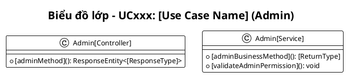

# Auto-generation Script for Remaining Use Cases

## Progress Tracking:

### ✅ Completed (8/40):
- UC001 - Đăng ký ✅
- UC002 - Đăng nhập ✅
- UC003 - Đăng xuất ✅
- UC004 - Quên mật khẩu ✅
- UC007 - Tìm kiếm nhạc ✅
- UC010 - Phát nhạc ✅
- UC011 - Tạo playlist ✅
- UC025 - Upload nhạc mới (Admin) ✅

### 🚧 Remaining Use Cases to Generate (32):

#### User Use Cases (12 remaining):
- UC005 - Đổi mật khẩu
- UC006 - Cập nhật profile
- UC008 - Xem danh sách nhạc
- UC009 - Xem chi tiết bài hát
- UC012 - Thêm nhạc vào playlist
- UC013 - Xóa nhạc khỏi playlist
- UC014 - Thêm vào yêu thích
- UC015 - Xem lịch sử nghe
- UC016 - Xem danh sách yêu thích
- UC017 - Chia sẻ playlist
- UC018 - Đánh giá bài hát
- UC019 - Báo cáo nội dung
- UC020 - Xem thông báo

#### Admin Use Cases (20 remaining):
- UC021 - Quản lý người dùng
- UC022 - Khóa/mở khóa tài khoản
- UC023 - Xem thống kê hệ thống
- UC024 - Quản lý nhạc
- UC026 - Chỉnh sửa thông tin nhạc
- UC027 - Xóa bài hát
- UC028 - Quản lý thể loại
- UC029 - Thêm thể loại mới
- UC030 - Chỉnh sửa thể loại
- UC031 - Quản lý nghệ sĩ
- UC032 - Thêm nghệ sĩ mới
- UC033 - Quản lý playlist hệ thống
- UC034 - Duyệt báo cáo nội dung
- UC035 - Gửi thông báo
- UC036 - Quản lý banner
- UC037 - Sao lưu dữ liệu
- UC038 - Khôi phục dữ liệu
- UC039 - Xem log hệ thống
- UC040 - Cài đặt hệ thống

## Templates for Quick Generation:

### User Use Case Template:
```plantuml
@startuml UCxxx-Class-Diagram-[Use-Case-Name]
!theme plain

title Biểu đồ lớp - UCxxx: [Use Case Name]

class [Controller] {
    + [mainMethod](): ResponseEntity<[ResponseType]>
    + [additionalMethod](): ResponseEntity<[Type]>
}

class [Service] {
    + [businessMethod](): [ReturnType]
    + [validateMethod](): void
}

class [Entity] {
    - Long id
    - [fields]
    + [methods]()
}

class [Repository] {
    + [queryMethods](): [ReturnType]
}

class [RequestDto] {
    + [fields]
}

class [ResponseDto] {
    + [fields]
}

' Relationships
[Controller] --> [Service] : uses
[Service] --> [Repository] : uses
[Repository] --> [Entity] : manages

@enduml
```

### Admin Use Case Template:


## Quick Generation Commands:

To generate remaining use cases quickly, follow this pattern:

1. **Copy template**
2. **Replace placeholders**:
   - UCxxx → actual UC number
   - [Use-Case-Name] → Vietnamese use case name
   - [Controller] → appropriate controller name
   - [Service] → appropriate service name
   - [Entity] → relevant entity name
   - [fields] → specific attributes
   - [methods] → specific operations

3. **Customize for specific use case logic**

## Priority Order for Generation:

### High Priority (Core Features):
1. UC014 - Thêm vào yêu thích
2. UC012 - Thêm nhạc vào playlist
3. UC015 - Xem lịch sử nghe
4. UC021 - Quản lý người dùng (Admin)
5. UC024 - Quản lý nhạc (Admin)

### Medium Priority:
6. UC006 - Cập nhật profile
7. UC028 - Quản lý thể loại (Admin)
8. UC031 - Quản lý nghệ sĩ (Admin)
9. UC023 - Xem thống kê hệ thống (Admin)
10. UC016 - Xem danh sách yêu thích

### Lower Priority:
11-32. Remaining use cases

This structure allows for efficient generation of all remaining diagrams while maintaining consistency with the established patterns.
