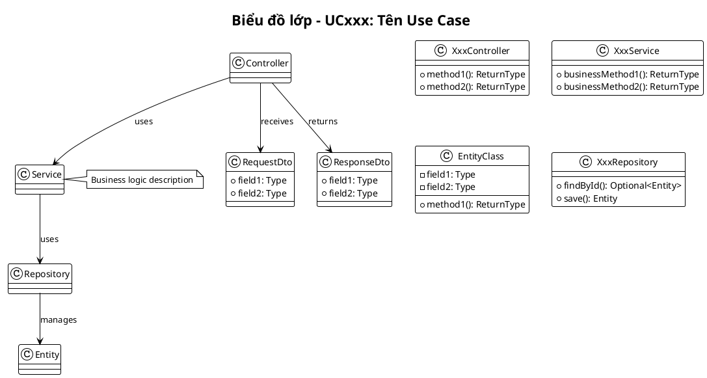
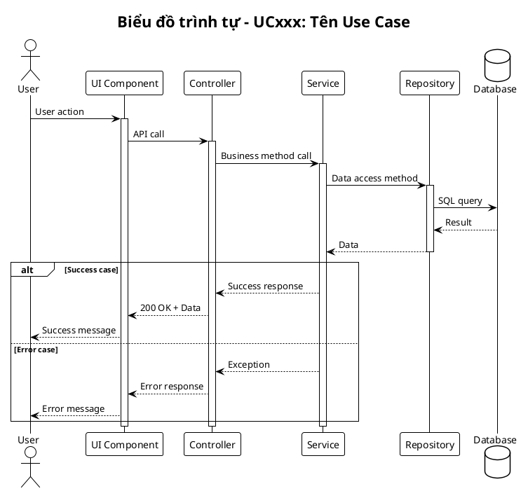

# Hướng dẫn tạo Biểu đồ Lớp và Biểu đồ Trình tự cho Use Cases

## Mẫu đã tạo:

### ✅ UC001 - Đăng ký:
- `uc001-class-diagram-dang-ky.puml` - Biểu đồ lớp
- `uc001-sequence-diagram-dang-ky.puml` - Biểu đồ trình tự

### ✅ UC002 - Đăng nhập:
- `uc002-class-diagram-dang-nhap.puml` - Biểu đồ lớp
- `uc002-sequence-diagram-dang-nhap.puml` - Biểu đồ trình tự

### ✅ UC010 - Phát nhạc:
- `uc010-class-diagram-phat-nhac.puml` - Biểu đồ lớp
- `uc010-sequence-diagram-phat-nhac.puml` - Biểu đồ trình tự

## Cấu trúc chung cho Biểu đồ Lớp:

## Cấu trúc chung cho Biểu đồ Trình tự:

## Danh sách Use Cases cần tạo biểu đồ:

### 👤 User Use Cases:
- [ ] UC001 - Đăng ký ✅
- [ ] UC002 - Đăng nhập ✅
- [ ] UC003 - Đăng xuất
- [ ] UC004 - Quên mật khẩu
- [ ] UC005 - Đổi mật khẩu
- [ ] UC006 - Cập nhật profile
- [ ] UC007 - Tìm kiếm nhạc
- [ ] UC008 - Xem danh sách nhạc
- [ ] UC009 - Xem chi tiết bài hát
- [ ] UC010 - Phát nhạc ✅
- [ ] UC011 - Tạo playlist
- [ ] UC012 - Thêm nhạc vào playlist
- [ ] UC013 - Xóa nhạc khỏi playlist
- [ ] UC014 - Thêm vào yêu thích
- [ ] UC015 - Xem lịch sử nghe
- [ ] UC016 - Xem danh sách yêu thích
- [ ] UC017 - Chia sẻ playlist
- [ ] UC018 - Đánh giá bài hát
- [ ] UC019 - Báo cáo nội dung
- [ ] UC020 - Xem thông báo

### 🛡️ Admin Use Cases:
- [ ] UC021 - Quản lý người dùng
- [ ] UC022 - Khóa/mở khóa tài khoản
- [ ] UC023 - Xem thống kê hệ thống
- [ ] UC024 - Quản lý nhạc
- [ ] UC025 - Upload nhạc mới
- [ ] UC026 - Chỉnh sửa thông tin nhạc
- [ ] UC027 - Xóa bài hát
- [ ] UC028 - Quản lý thể loại
- [ ] UC029 - Thêm thể loại mới
- [ ] UC030 - Chỉnh sửa thể loại
- [ ] UC031 - Quản lý nghệ sĩ
- [ ] UC032 - Thêm nghệ sĩ mới
- [ ] UC033 - Quản lý playlist hệ thống
- [ ] UC034 - Duyệt báo cáo nội dung
- [ ] UC035 - Gửi thông báo
- [ ] UC036 - Quản lý banner
- [ ] UC037 - Sao lưu dữ liệu
- [ ] UC038 - Khôi phục dữ liệu
- [ ] UC039 - Xem log hệ thống
- [ ] UC040 - Cài đặt hệ thống

## Hướng dẫn sử dụng:

1. **Copy template** phù hợp (class diagram hoặc sequence diagram)
2. **Thay thế tên use case** và các class/method tương ứng
3. **Điều chỉnh relationships** giữa các lớp
4. **Thêm notes** giải thích logic phức tạp
5. **Test trên planttext.com** để đảm bảo syntax đúng

## Lưu ý:

- Sử dụng naming convention Tiếng Việt có dấu cho title
- File name dùng format: `ucXXX-type-diagram-ten-use-case.puml`
- Thêm `!theme plain` để có giao diện đẹp
- Sử dụng `alt/else/end` cho các luồng điều kiện
- Thêm `activate/deactivate` cho sequence diagrams

Bạn có thể copy các file mẫu và chỉnh sửa cho từng use case khác!
